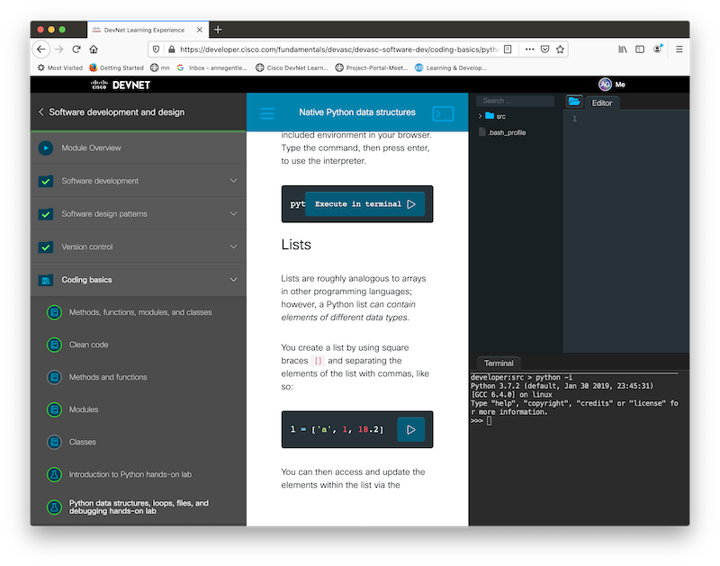
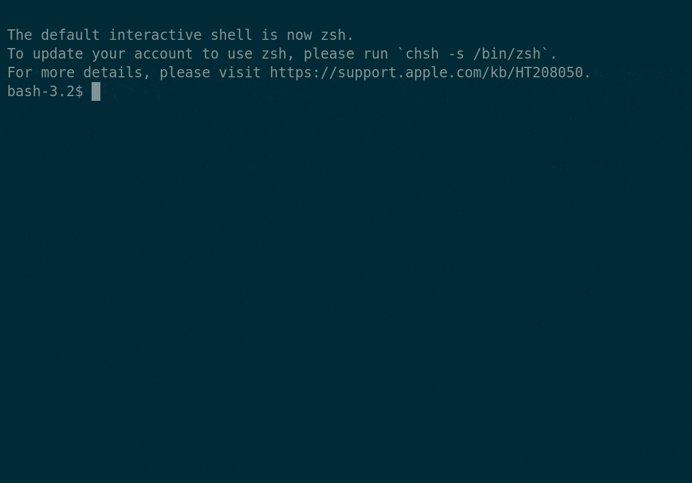

# Cisco DevNet Associate Fundamentals Course code examples

One of the best ways to study for the [Cisco DevNet Associate Certification](https://developer.cisco.com/certification/) is through hands-on practice using worked examples. 

This repository contains code examples for the [DevNet Associate Fundamentals course](https://developer.cisco.com/certification/fundamentals/?utm_campaign=github21&utm_source=website&utm_medium=github-devasc-code-examples) available on the DevNet site. This course also has a related [Study Group available for DevNet Associate Certification](https://developer.cisco.com/certification/devasc-group/?utm_campaign=github21&utm_source=website&utm_medium=github-devasc-code-examples).

## Requirements

Python 3.7 or higher

## Instructions

You can clone this repo locally to work within your own development environment. To set up a developer environment, you can refer to the [DevNet Learning Labs](https://developer.cisco.com/learning-labs/setup/?utm_campaign=github21&utm_source=website&utm_medium=github-devasc-code-examples).

The `master` branch contains the blank files that you can fill in during the course.

The `solutions` branch contains the working code.

The `src` folder contains code examples for all the hands-on exercises so you can try them in your own development environment. 

This code requires Python3. The [requirements.txt](./requirements.txt) file lists all the dependencies required by the code used in the course. Follow the instructions below to setup a local developerment environment that matches the in-browser development environment used in the course. Here's a quick walkthrough.

## Get a local copy of the code

1. Clone the repository. For example, `git clone https://github.com/CiscoDevNet/devasc-code-examples.git`. 
2. Change to the directory that contains the code files: `cd devasc-code-examples/`.
   
## Set up a Python Virtual Environment

You want to work in a [Python virtual environment](https://docs.python.org/3/tutorial/venv.html) so that you can be certainly only the required dependencies are installed and used for this project. 

> Note: This repository does not contain the source code for the Library REST API example included with the course development environment. You cannot run the `main.py` file and make calls successfully without the service available in the course.

### MacOS or Linux

1. `python3 -m venv venv`
2. `source venv/bin/activate`
3. `pip install -r requirements.txt`
        
### Windows - recommendation to use git-bash terminal

1. `py -3 -m venv venv`
2. `source venv/Scripts/activate`
3. `pip install -r requirements.txt`
